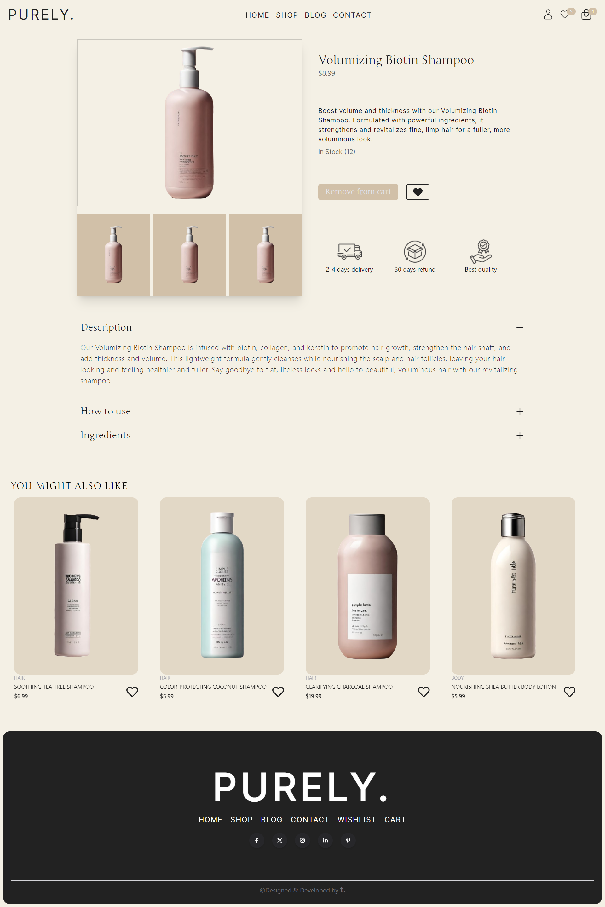

<h1>E-commerce Poroject</h1>
  <h3>About the project</h3>
  
A comprehensive project featuring an eCommerce platform for cosmetics alongside a blog. Seamlessly browse and purchase beauty products while staying informed with engaging beauty-related content.

Live Demo: <a href='https://purely.vercel.app/'>Purely. Shop Demo</a>  
» React JS  
» TailwindCSS

  <h2>Project Screenshots</h2>

<h3 align='center'>Home Page </h3>

<h3 align='center'>Shop Page </h3>

<h3 align='center'>Product Page </h3>

<h3 align='center'>Cart Page </h3>

<h3 align='center'>Wishlist Page </h3>

<h3 align='center'>Blog Page </h3>

<h3 align='center'>Contact Page </h3>

